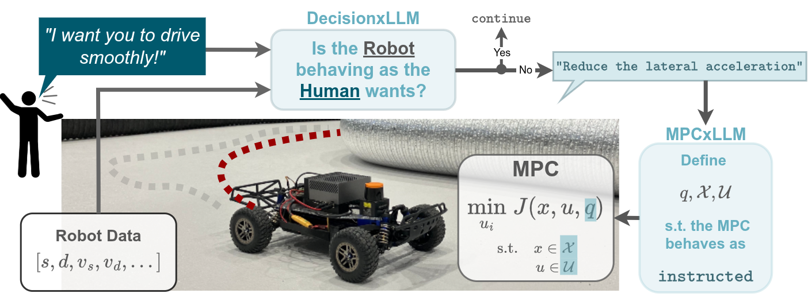

# Enhancing Autonomous Driving Systems with On-Board Deployed Large Language Models

This repository accompanies our [RSS 2025 paper](https://arxiv.org/abs/2504.11514), **Enhancing Autonomous Driving Systems with On-Board Deployed Large Language Models**. It provides the codebase for the **MPCxLLM** and **DecisionxLLM** modules, alongside tools for training, testing, and deployment.

<p align="center"\>
  
</p\>

Watch an explanatory Youtube video accompanying the paper [here](https://www.youtube.com/watch?v=4iGN1uBl4v4).

## 🚀 Installation

### CUDA Platform (e.g., RTX 30xx / 40xx)

1. Build the Docker container (adapt `CUDA_ARCH` accordingly: `86` for RTX 30xx, `89` for 40xx):
   ```bash
   docker build --build-arg CUDA_ARCH=<your_compute_capability> -t embodiedai -f .docker_utils/Dockerfile.cuda .
   ```

2. Mount the container to the project directory:
   ```bash
   ./.docker_utils/main_dock.sh cuda
   ```

3. Attach to the container:
   ```bash
   docker exec -it embodiedai /bin/bash
   ```
   or use VS Code Remote Containers.

---

### Jetson Platform (e.g., Orin AGX)

1. Build the ARM-compatible Docker image:
   ```bash
   docker build -t embodiedai -f .docker_utils/Dockerfile.jetson .
   ```
   **Note that on the jetson, unsloth can not be installed (as of 07.05.2025). So only inference via quantized models are possible!**

2. Mount and launch the container:
   ```bash
   ./.docker_utils/main_dock.sh jetson
   ```

3. Attach via terminal or VS Code.

### Create .env File
Create a `.env` file in the root directory with the following content:
```bash
HUGGINGFACEHUB_API_TOKEN="<your_huggingface_token>"
OPENAI_API_TOKEN="<your_openai_token>"
```
This is needed for downloading models and using OpenAI APIs which is required if you want to use `gpt-4o` or for using the modules with their RAG embeddings. **Make sure to keep this file private!**

### Download Models (optional)
You can use the LoRA + RAG SFT trained FP16 model [nibauman/RobotxLLM_Qwen7B_SFT](https://huggingface.co/nibauman/RobotxLLM_Qwen7B_SFT) directly from HuggingFace 
without having to download it locally. If you want to use the quantized model, you can download it with the following command:

```bash
huggingface-cli download nibauman/race_llm-Q5_K_M-GGUF --local-dir models/race_llm_q5
```

---

## 🧠 Usage

This repo integrates with the [ForzaETH Race Stack](https://github.com/ForzaETH/race_stack). Follow their installation instructions and ensure your `ROS_MASTER_URI` is correctly configured (see [example line](https://github.com/ForzaETH/race_stack/blob/main/.devcontainer/.install_utils/bashrc_ext#L12)) in this readme we use 192.168.192.75 as an example (Check $ROS_HOSTNAME when running the race_stack)!

### On the Robot Stack
Run each command in a separate terminal.
```bash
roscore
roslaunch stack_master base_system.launch map_name:=f racecar_version:=NUC2 sim:=true
roslaunch stack_master time_trials.launch ctrl_algo:=KMPC
roslaunch rosbridge_server rosbridge_websocket.launch address:=192.168.192.75
```

### On the LLM Machine

```bash
python3 llm_mpc.py --model custom --model_dir nibauman/RobotxLLM_Qwen7B_SFT --hostip 192.168.192.75 --prompt "Drive in Reverse!"
```

**Key Options:**

- `--model`: `custom` or `gpt-4o`
- `--model_dir`: HuggingFace or local path (used for `custom`)
- `--hostip`: ROS master IP
- `--prompt`: Natural language instruction
- `--quant`: Use quantized `GGUF` model
- `--mpconly`: Skip DecisionxLLM

As an **example** for on the **Jetson** you can only run the quantized models with the models downloaded to the models folder as explained above. You can run the following command to test the quantized model:
```bash
python3 llm_mpc.py --model custom --model_dir models/race_llm_q5 --hostip 192.168.192.75 --prompt "Drive in Reverse!" --quant
```
---

## 🏋️ Training

To train a new LoRA adapter on synthetic data:

```bash
python3 -m train.sft_train --config train/config/sft_train.yaml
```

You can modify `sft_train.yaml` to change the model or dataset. Default setup:

- Base: `unsloth/Qwen2.5-7B-Instruct`
- Dataset: `train/dataset/`
- Output: `train/outputs/`

---

## 📊 Evaluation

### MPCxLLM Evaluation (requires autonomy stack)

```bash
python3 -m tests.mpc_tester.mpc_tester --model custom --model_dir nibauman/RobotxLLM_Qwen7B_SFT --host_ip 192.168.192.75
```

### DecisionxLLM Evaluation (autonomy stack not required)

```bash
python3 -m tests.decision_tester.decision_tester --model nibauman/RobotxLLM_Qwen7B_SFT --dataset all --mini --rag
```

**Evaluation Options:**

- `--dataset`: e.g., `all`, `stop`, `reverse`, etc.
- `--mini`: Run a small evaluation subset
- `--rag`: Enable retrieval-augmented decision prompts
- `--quant`: Use quantized model
---
## Acknowledgements
SFT training was performed through the distillation of [OpenAI GPT-4o](https://openai.com/index/hello-gpt-4o/) queries.
This work would not have been possible without the great work of other repositories such as:
- [llama.cpp](https://github.com/ggml-org/llama.cpp)
- [Hugging Face](https://github.com/huggingface)
- [unsloth](https://github.com/unslothai/unsloth)
- [roslibpy](https://github.com/gramaziokohler/roslibpy)
---

## 📄 Citation

If this repository is useful for your research, please consider citing our work:

```bibtex
@article{baumann2025enhancing,
  title={Enhancing Autonomous Driving Systems with On-Board Deployed Large Language Models},
  author={Baumann, Nicolas and Hu, Cheng and Sivasothilingam, Paviththiren and Qin, Haotong and Xie, Lei and Magno, Michele and Benini, Luca},
  journal={arXiv preprint arXiv:2504.11514},
  year={2025}
}
```
